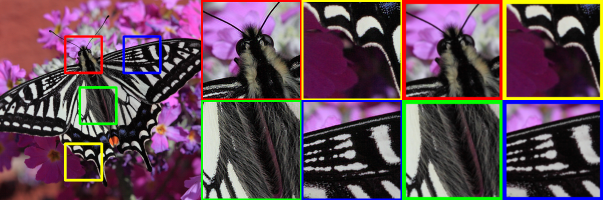
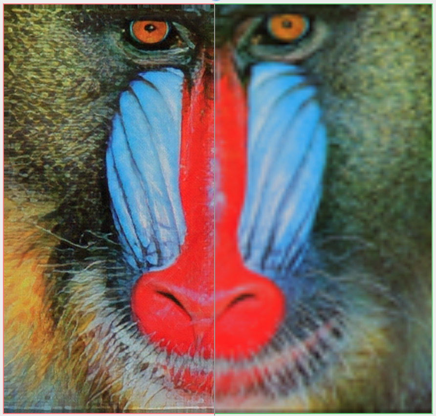
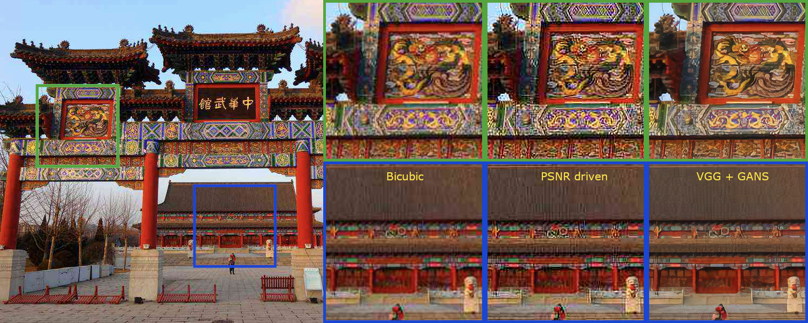

# Image Super-Resolution (ISR)


[](https://travis-ci.org/idealo/image-super-resolution)
[](https://idealo.github.io/image-super-resolution/)
[](https://github.com/idealo/image-super-resolution/blob/master/LICENSE)

The goal of this project is to upscale and improve the quality of low resolution images.

Since the code is no longer actively maintained, it will be archived on 2025-01-03.

This project contains Keras implementations of different Residual Dense Networks for Single Image Super-Resolution (ISR) as well as scripts to train these networks using content and adversarial loss components.  

The implemented networks include:

- The super-scaling Residual Dense Network described in [Residual Dense Network for Image Super-Resolution](https://arxiv.org/abs/1802.08797) (Zhang et al. 2018)
- The super-scaling Residual in Residual Dense Network described in [ESRGAN: Enhanced Super-Resolution Generative Adversarial Networks](https://arxiv.org/abs/1809.00219) (Wang et al. 2018)
- A multi-output version of the Keras VGG19 network for deep features extraction used in the perceptual loss
- A custom discriminator network based on the one described in [Photo-Realistic Single Image Super-Resolution Using a Generative Adversarial Network](https://arxiv.org/abs/1609.04802) (SRGANS, Ledig et al. 2017)

Read the full documentation at: [https://idealo.github.io/image-super-resolution/](https://idealo.github.io/image-super-resolution/).

[Docker scripts](https://idealo.github.io/image-super-resolution/tutorials/docker/) and [Google Colab notebooks](https://github.com/idealo/image-super-resolution/tree/master/notebooks) are available to carry training and prediction. Also, we provide scripts to facilitate training on the cloud with AWS and [nvidia-docker](https://github.com/NVIDIA/nvidia-docker) with only a few commands.

ISR is compatible with Python 3.6 and is distributed under the Apache 2.0 license. We welcome any kind of contribution. If you wish to contribute, please see the [Contribute](#contribute) section.

## Contents
- [Pre-trained networks](#pre-trained-networks)
- [Installation](#installation)
- [Usage](#usage)
- [Additional Information](#additional-information)
- [Contribute](#contribute)
- [Citation](#citation)
- [Maintainers](#maintainers)
- [License](#copyright)

## Troubleshooting
### Training not delivering good/patchy results
When training your own model, start with only PSNR loss (50+ epochs, depending on the dataset) and only then introduce GANS and feature loss. This can be controlled by the loss weights argument.

This is just sample, you will need to tune these parameters.

PSNR only:
```
loss_weights = {
  'generator': 1.0,
  'feature_extractor': 0.0,
  'discriminator': 0.00
}
```

Later:
```
loss_weights = {
  'generator': 0.0,
  'feature_extractor': 0.0833,
  'discriminator': 0.01
}
```
### Weights loading
If you are having trouble loading your own weights or the pre-trained weights (`AttributeError: 'str' object has no attribute 'decode'`), try:
```bash
pip install 'h5py==2.10.0' --force-reinstall
```
[Issue](https://github.com/idealo/image-super-resolution/issues/197#issue-877826405)

## Pre-trained networks

The weights used to produced these images are available directly when creating the model object. 

Currently 4 models are available:
  - RDN: psnr-large, psnr-small, noise-cancel
  - RRDN: gans
 
Example usage:

```
model = RRDN(weights='gans')
```
  
The network parameters will be automatically chosen.
(see [Additional Information](#additional-information)).

#### Basic model
RDN model, PSNR driven, choose the option ```weights='psnr-large'``` or ```weights='psnr-small'``` when creating a RDN model.

||
|:--:|
| Low resolution image (left), ISR output (center), bicubic scaling (right). Click to zoom. |
#### GANS model
RRDN model, trained with Adversarial and VGG features losses, choose the option ```weights='gans'``` when creating a RRDN model.

||
|:--:|
| RRDN GANS model (left), bicubic upscaling (right). |
-> [more detailed comparison](http://www.framecompare.com/screenshotcomparison/PGZPNNNX)

#### Artefact Cancelling GANS model
RDN model, trained with Adversarial and VGG features losses, choose the option ```weights='noise-cancel'``` when creating a RDN model.

||
|:--:|
| Standard vs GANS model. Click to zoom. |


||
|:--:|
| RDN GANS artefact cancelling model (left), RDN standard PSNR driven model (right). |
-> [more detailed comparison](http://www.framecompare.com/screenshotcomparison/2ECCNNNU)


## Installation
There are two ways to install the Image Super-Resolution package:

- Install ISR from PyPI (recommended):
```
pip install ISR
```
- Install ISR from the GitHub source:
```
git clone https://github.com/idealo/image-super-resolution
cd image-super-resolution
python setup.py install
```

## Usage

### Prediction

Load image and prepare it
```python
import numpy as np
from PIL import Image

img = Image.open('data/input/test_images/sample_image.jpg')
lr_img = np.array(img)
```

Load a pre-trained model and run prediction (check the prediction tutorial under notebooks for more details)
```python
from ISR.models import RDN

rdn = RDN(weights='psnr-small')
sr_img = rdn.predict(lr_img)
Image.fromarray(sr_img)
```

#### Large image inference
To predict on large images and avoid memory allocation errors, use the `by_patch_of_size` option for the predict method, for instance
```
sr_img = model.predict(image, by_patch_of_size=50)
```
Check the documentation of the `ImageModel` class for further details.

### Training

Create the models
```python
from ISR.models import RRDN
from ISR.models import Discriminator
from ISR.models import Cut_VGG19

lr_train_patch_size = 40
layers_to_extract = [5, 9]
scale = 2
hr_train_patch_size = lr_train_patch_size * scale

rrdn  = RRDN(arch_params={'C':4, 'D':3, 'G':64, 'G0':64, 'T':10, 'x':scale}, patch_size=lr_train_patch_size)
f_ext = Cut_VGG19(patch_size=hr_train_patch_size, layers_to_extract=layers_to_extract)
discr = Discriminator(patch_size=hr_train_patch_size, kernel_size=3)
```

Create a Trainer object using the desired settings and give it the models (`f_ext` and `discr` are optional)
```python
from ISR.train import Trainer
loss_weights = {
  'generator': 0.0,
  'feature_extractor': 0.0833,
  'discriminator': 0.01
}
losses = {
  'generator': 'mae',
  'feature_extractor': 'mse',
  'discriminator': 'binary_crossentropy'
}

log_dirs = {'logs': './logs', 'weights': './weights'}

learning_rate = {'initial_value': 0.0004, 'decay_factor': 0.5, 'decay_frequency': 30}

flatness = {'min': 0.0, 'max': 0.15, 'increase': 0.01, 'increase_frequency': 5}

trainer = Trainer(
    generator=rrdn,
    discriminator=discr,
    feature_extractor=f_ext,
    lr_train_dir='low_res/training/images',
    hr_train_dir='high_res/training/images',
    lr_valid_dir='low_res/validation/images',
    hr_valid_dir='high_res/validation/images',
    loss_weights=loss_weights,
    learning_rate=learning_rate,
    flatness=flatness,
    dataname='image_dataset',
    log_dirs=log_dirs,
    weights_generator=None,
    weights_discriminator=None,
    n_validation=40,
)
```

Start training
```python
trainer.train(
    epochs=80,
    steps_per_epoch=500,
    batch_size=16,
    monitored_metrics={'val_PSNR_Y': 'max'}
)
```

## Additional Information
You can read about how we trained these network weights in our Medium posts:
- part 1: [A deep learning based magnifying glass](https://medium.com/idealo-tech-blog/a-deep-learning-based-magnifying-glass-dae1f565c359)
- part 2: [Zoom in... enhance](https://medium.com/idealo-tech-blog/zoom-in-enhance-a-deep-learning-based-magnifying-glass-part-2-c021f98ebede
)

### RDN Pre-trained weights
The weights of the RDN network trained on the [DIV2K dataset](https://data.vision.ee.ethz.ch/cvl/DIV2K) are available in ```weights/sample_weights/rdn-C6-D20-G64-G064-x2/PSNR-driven/rdn-C6-D20-G64-G064-x2_PSNR_epoch086.hdf5```. <br>
The model was trained using ```C=6, D=20, G=64, G0=64``` as parameters (see architecture for details) for 86 epochs of 1000 batches of 8 32x32 augmented patches taken from LR images.

The artefact can cancelling weights obtained with a combination of different training sessions using different datasets and perceptual loss with VGG19 and GAN can be found at `weights/sample_weights/rdn-C6-D20-G64-G064-x2/ArtefactCancelling/rdn-C6-D20-G64-G064-x2_ArtefactCancelling_epoch219.hdf5`
We recommend using these weights only when cancelling compression artefacts is a desirable effect.

### RDN Network architecture
The main parameters of the architecture structure are:
- D - number of Residual Dense Blocks (RDB)
- C - number of convolutional layers stacked inside a RDB
- G - number of feature maps of each convolutional layers inside the RDBs
- G0 - number of feature maps for convolutions outside of RDBs and of each RBD output


<br>


source: [Residual Dense Network for Image Super-Resolution](https://arxiv.org/abs/1802.08797)

### RRDN Network architecture
The main parameters of the architecture structure are:
- T - number of Residual in Residual Dense Blocks (RRDB)
- D - number of Residual Dense Blocks (RDB) insider each RRDB
- C - number of convolutional layers stacked inside a RDB
- G - number of feature maps of each convolutional layers inside the RDBs
- G0 - number of feature maps for convolutions outside of RDBs and of each RBD output


<br>


source: [ESRGAN: Enhanced Super-Resolution Generative Adversarial Networks](https://arxiv.org/abs/1809.00219)

## Contribute
We welcome all kinds of contributions, models trained on different datasets, new model architectures and/or hyperparameters combinations that improve the performance of the currently published model.

Will publish the performances of new models in this repository.

See the [Contribution](CONTRIBUTING.md) guide for more details.

#### Bump version
To bump up the version, use
```
bumpversion {part} setup.py
```

## Citation
Please cite our work in your publications if it helps your research.

```BibTeX
@misc{cardinale2018isr,
  title={ISR},
  author={Francesco Cardinale et al.},
  year={2018},
  howpublished={\url{https://github.com/idealo/image-super-resolution}},
}
```

## Maintainers
* Francesco Cardinale, github: [cfrancesco](https://github.com/cfrancesco)
* Dat Tran, github: [datitran](https://github.com/datitran)

## Copyright

See [LICENSE](LICENSE) for details.
